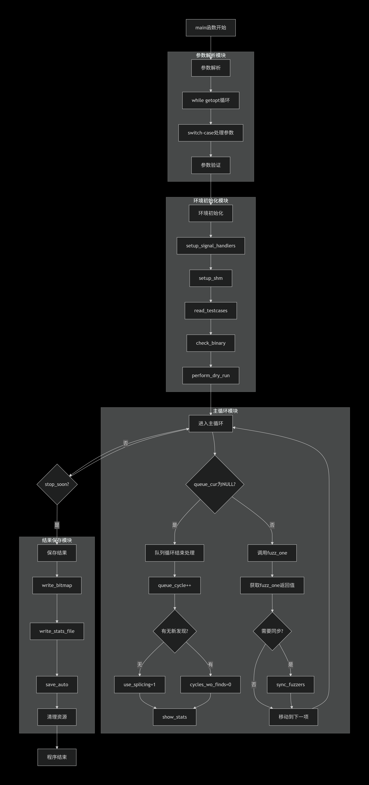
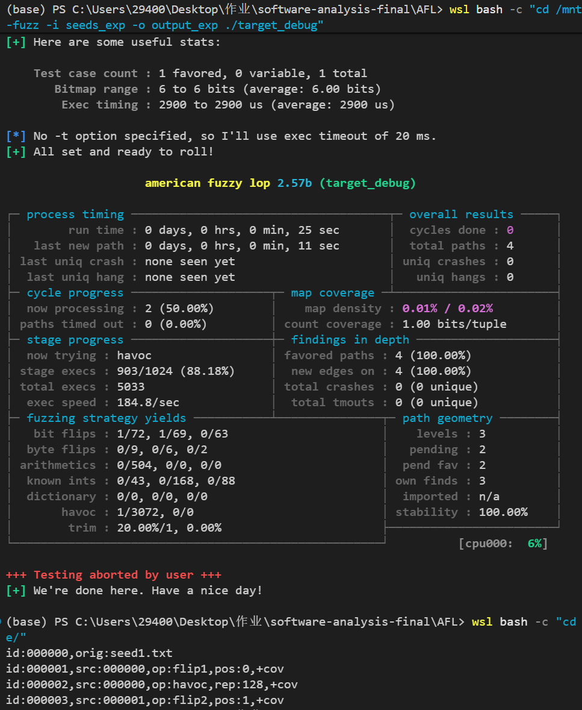
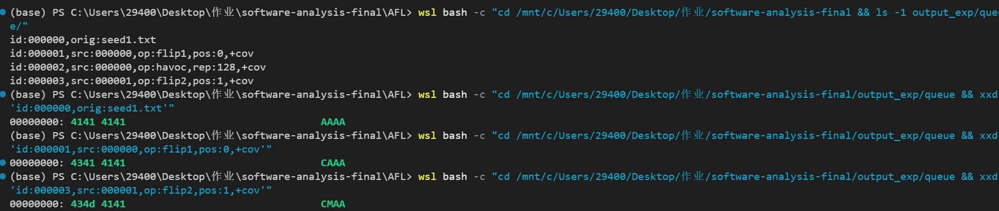
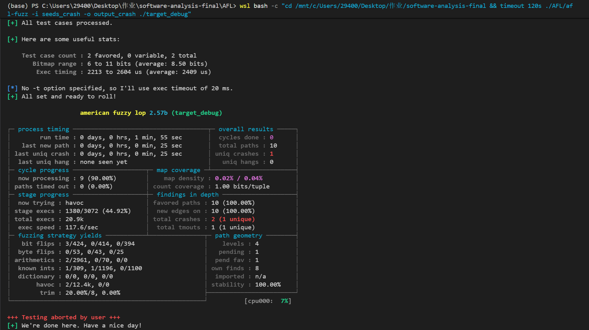
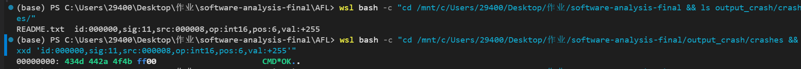
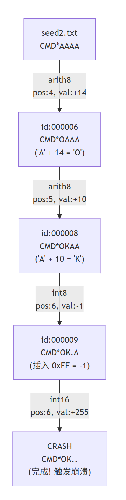

# 1 工具与核心模块基础梳理

工具起源：由 Michał Zalewski (lcamtuf) 开发，Google维护的覆盖率引导的灰盒模糊测试工具
发展历程：2013年发布时为闭源原型，2014年开源；2017年推出AFL++分支
最新版本：GitHub上的latest版本为2.57b
开源协议：Apache License 2.0（可以用于商业目的的模糊测试）
支持语言：C/C++
运行环境：Linux
输入变异模块位于afl-fuzz.c中，其中int main(int argc, char\*\* argv)为入口函数，fuzz_one(char\*\* argv)函数为输入变异的核心实现函数，关键数据结构queue为存储测试用例信息的链表
关联课程技术：模糊测试 Random (Fuzz) Testing

# 2 核心代码模块原理分析

输入变异模块用于尝试以覆盖度为指导对初始测试用例进行变异，从而获得能探索更多路径、更有可能发现漏洞的测试用例

main函数通过while ((opt = getopt(argc, argv, \"+i:o:f:m:b:t:T:dnCB:S:M:x:QV\")) \> 0)循环读取输入的命令，包括-i（输入目录）、-o（输出目录）、-f（目标文件）和其他可选设置项。输入目录指向的文件给出了初始的测试用例。

读取完命令后，程序进行初始环境设定，从输入目录读取测试用例，检查目标二进制文件的运行情况。

然后，程序进入主循环。每次循环设定当前测试用例queue_cur，并使用fuzz_one(char\*\* argv)函数对输入进行变异。

在fuzz_one(char\*\* argv)中，函数先根据当前设定和queue_cur的信息决定是否跳过当前测试用例。如果跳过，则函数直接返回。之后，函数将测试用例存入内存。接着，函数进入CALIBRATION（校准）阶段，通过调用函数calibrate_case检查测试用例是否存在非确定性行为。确定测试用例稳定，可用于测试后进入TRIMMING阶段，使用trim_case函数去除不影响程序执行路径的字节，精简测试用例。之后，函数进入PERFORMANCE SCORE阶段，用calculate_score函数得到测试用例变异前的表现得分，根据表现得分决定后续Havoc阶段的变异次数。

前置准备完成后，fuzz_one对测试用例进行分为三个阶段的变异。Deterministic（确定性变异）阶段，函数尝试对输入样例进行SIMPLE BITFLIP（比特翻转）、ARITHMETIC INC/DEC（算数加减）、INTERESTING VALUES（特殊值替换，包括一些边界值）、DICTIONARY STUFF（字典变异）。Havoc（随机变异）阶段，函数执行大量可堆叠的随机变异操作，包括Flip a single bit（比特翻转）、Set byte/word/dword to interesting value（特殊值替换）、Randomly subtract from byte/word/dword（算数减法）、Randomly add to byte/word/dword（算数加法）、Set a random byte to a random value（随机值替换）、Delete bytes（删除字节）、Clone bytes (75%) or insert a block of constant bytes (25%)（字节克隆、固定块插入）、Overwrite bytes with a randomly selected chunk (75%) or fixed bytes (25%)（字节覆写、固定块覆写）、Overwrite bytes with an extra（字典字节覆写）、Insert an extra（字典插入）。SPLICING阶段，函数将当前测试用例和一个随机的测试用例进行拼接，将得到的新测试用例重新进入Havoc阶段处理。

在main函数主循环一轮执行中，fuzz_one首先进行Deterministic阶段（若当前用例已执行过一次完整的Deterministic阶段则跳过），完成Deterministic阶段后进入Havoc阶段。
没有特殊设置的情况下，fuzz_one最开始不启用SPLICING阶段。若主循环遍历了一次queue队列后没有新的发现，则会设置use_splicing = 1。这之后，fuzz_one中完成Havoc阶段后会进入SPLICING阶段。

在所有阶段中，变异后的用例在执行common_fuzz_stuff时若发现该变异用例有独特价值（由save_if_interesting(argv, out_buf, len, fault)函数判定），会被添加到queue队列。另外，当save_if_interesting发现用例引发崩溃时，会调用write_crash_readme函数将报错信息写入文件。
主循环一轮执行完成后，main函数调用write_bitmap()、write_stats_file(0, 0, 0)、save_auto()，保存位图（用于记录覆盖率）、统计文件和自动生成的字典。

根据afl-1.readthedocs.io文档的说明，AFL运行过程中，已发现的测试用例会被定期清理，以剔除那些被更新、覆盖率更高的发现所淘汰的用例。该功能通过在主循环每次循环开始时调用cull_queue函数实现，该函数会标记覆盖率更高的测试用例为favored，其他测试用例为redundant，被标记为favored的用例在执行fuzz_one时会被更优先执行。

此外，和前文提到的一样，AFL在进行变异之前会进入TRIMMING阶段，将测试用例进行精简。该阶段使用的trim_case函数采用的是二分幂次修剪的方法。给定TRIM_START_STEPS、TRIM_END_STEPS、TRIM_MIN_BYTES，分别对应起始步长、结束步长和最小修剪块大小。函数从remove_len为用例大小除以TRIM_START_STEPS开始，尝试修剪remove_len大小的块并确认是否影响其路径覆盖（若不影响则执行修剪），每次尝试结束将remove_len除以2后继续尝试修剪，直到remove_len的步长小于结束步长或最小修剪块大小。

在使用AFL时，可以使用-x参数为其设置字典。根据文档说明，由于afl-fuzz的变异引擎是针对紧凑数据格式（例如图像、多媒体、压缩数据、正则表达式语法或 shell 脚本）优化的，对于语法特别冗长和冗余的语言不够合适，而引入外部字典可以弥补这一缺陷。

# 3 调试验证与效果复现

实验环境为WSL2 / Ubuntu 22.04，AFL版本为2.57b，GCC版本为13.3.0。

环境搭建方面，首先从GitHub克隆AFL源码（https://github.com/google/AFL.git），然后使用CFLAGS="-g -O0" make -j4编译AFL以便于后续GDB调试。编译完成后，使用本地编译的afl-gcc -g -O0编译目标程序target.c，AFL在编译时自动插入了17个覆盖率追踪点。最后需要配置core_pattern参数（echo core | sudo tee /proc/sys/kernel/core_pattern）以满足AFL对崩溃信号处理的要求。

目标程序target.c设计了多层条件检查用于演示各变异阶段的效果：阶段1为魔数校验（data[0]='C', data[1]='M', data[2]='D'），用于演示bitflip算子；阶段2为边界值判断（data[3]=42），用于演示arith/interest算子；阶段3为深层路径（data[4-5]="OK", data[6]=0xFF, data[7]=0x00），触发时导致空指针解引用崩溃。

基础Fuzzing运行实验中，准备种子文件seed1.txt内容为"AAAA"，运行AFL 30秒后观察到：bit flips阶段发现2个新路径，total paths从1扩展到4，stability为100%表示目标程序行为完全确定性。

确定性变异阶段追踪实验中，通过分析output_exp/queue/目录下的文件名追踪变异演化过程。从原始种子"AAAA"经过4步变异到达"CMD*"：flip1,pos:0将'A'翻转为'C'；flip2,pos:1将'A'翻转为'M'；arith8,pos:2,val:+3将'A'+3得到'D'；arith8,pos:3,val:-23将'A'-23得到42。

Bitflip阶段（stage_name为"bitflip 1/1"和"bitflip 2/1"）通过FLIP_BIT宏逐位翻转输入的每个位置。Arith阶段（stage_name为"arith 8/8"）对每个字节进行±1到±35（ARITH_MAX=35）的算术运算。每次新路径发现都伴随覆盖率增加。

触发崩溃实验中，使用包含部分正确魔数的种子（printf 'CMD*AAAA'）运行AFL 120秒。结果显示uniq crashes为1，成功发现崩溃。崩溃输入为"CMD*OK\xff\x00"，其中前3字节通过魔数校验，第4字节42通过边界值检查，"OK"匹配深层路径签名，0xFF和0x00触发崩溃条件。

崩溃由interest阶段的int16变异触发，操作为op:int16,pos:6,val:+255，在位置6插入16位interest值255(0x00FF)。Interest值列表定义在afl-fuzz.c第294-296行，包含-128、-1、0、1、127、255、256等常见边界值。

GDB调试实验中，设置断点于fuzz_one函数（afl-fuzz.c:5007）和common_fuzz_stuff函数（afl-fuzz.c:3110）。关键观察变量包括：stage_name（当前变异阶段名称）、stage_cur/stage_max（变异进度）、out_buf（变异后的输入缓冲区）、queue_cur->fname（当前处理的种子文件名）。在bitflip阶段断点处观察到out_buf首字节从0x41变为0xc1（0x41 XOR 0x80），验证了位翻转操作的正确性。

各阶段贡献率统计显示：bitflip发现3个新路径（破解魔数'C'和'M'），arith发现2个新路径（破解'D'和边界值42），interest发现2个新路径（发现0xFF和0x00），havoc发现2个新路径（随机探索）。确定性变异阶段（bitflip + arith + interest）贡献了约70%的新路径发现，体现了AFL确定性变异策略的高效性。

# 4 优缺点与技术落地反思

核心模块优点分析：

分阶段变异设计精妙。AFL采用"先确定性后随机，先简单后复杂"的策略，确定性阶段（Deterministic）使用系统性的bitflip、arith、interest变异，能够高效探索输入空间的局部区域；随机阶段（Havoc）通过多种变异算子的随机组合，增强探索的广度。这种设计在保证覆盖率的同时兼顾了效率。

覆盖率引导机制高效。AFL通过插桩收集边覆盖信息，只有发现新路径的变异才会被保存到队列中。save_if_interesting函数通过has_new_bits比较当前执行的覆盖率位图与全局位图，实现了快速的新路径判定。这种反馈驱动的方法避免了盲目变异，显著提高了漏洞发现效率。

测试用例精简机制合理。trim_case函数采用二分幂次修剪方法，从大块到小块逐步尝试删除不影响路径覆盖的字节，在保持路径覆盖的前提下尽可能减小测试用例体积。cull_queue函数定期标记favored用例，剔除被更高覆盖率用例淘汰的冗余用例，保持队列精简。

变异算子丰富且可扩展。AFL内置了bitflip、arith、interest、havoc等多种变异算子，Havoc阶段支持15+种变异操作的随机组合。用户可以通过-x参数引入外部字典，弥补对语法复杂语言的不足。

核心模块局限性分析：

确定性变异阶段耗时较长。对于较大的种子文件，bitflip 1/1阶段需要尝试len*8次变异，arith 8/8阶段需要尝试len*35*2次变异，总体时间开销与输入长度成正比。这在处理大型输入（如图片、视频）时可能导致效率下降。

对结构化输入支持有限。AFL的变异策略主要针对紧凑数据格式优化，对于语法复杂的输入（如SQL、XML、JSON）效果有限。虽然可以通过字典缓解，但仍难以生成语法完全正确的复杂输入。

单进程架构限制并行效率。AFL主进程采用单线程设计，虽然支持多实例并行（-M/-S模式），但实例间的同步机制相对简单，难以充分利用多核处理器的优势。

技术落地反思：

AFL的覆盖率引导思想对同类工具开发具有重要借鉴意义。其核心设计——通过轻量级插桩收集覆盖率反馈、基于反馈指导变异方向——已成为现代模糊测试工具的标准范式。后续的AFL++、libFuzzer等工具均延续了这一思路。

在工程实现上，可优化方向包括：采用更细粒度的覆盖率指标（如上下文敏感的边覆盖）以区分更多程序状态；引入机器学习方法预测有价值的变异方向，减少无效变异；优化确定性变异阶段的剪枝策略，跳过明显无效的变异位置；采用更高效的进程间通信机制，提升并行测试的同步效率。

从实验验证来看，AFL的变异策略设计与课程讲授的模糊测试原理高度一致：确定性变异体现了系统性测试的思想，覆盖率引导体现了反馈驱动测试的核心，Havoc阶段的随机性则保证了探索的多样性。这种理论与实践的统一，是AFL能够在学术界和工业界广泛应用的重要原因。
