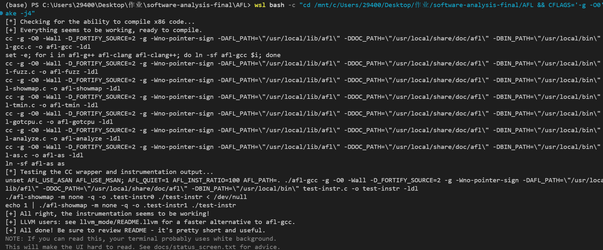
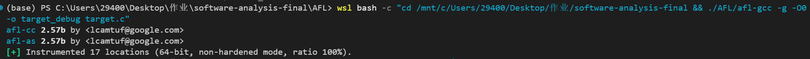
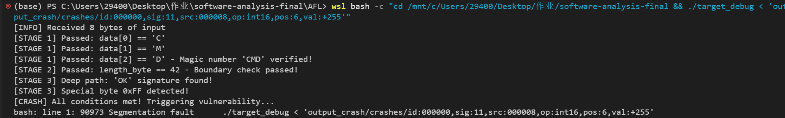
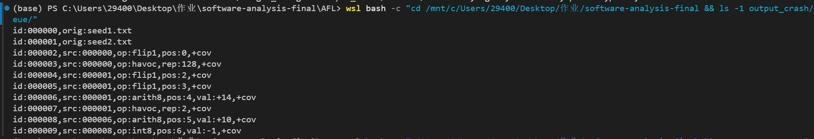
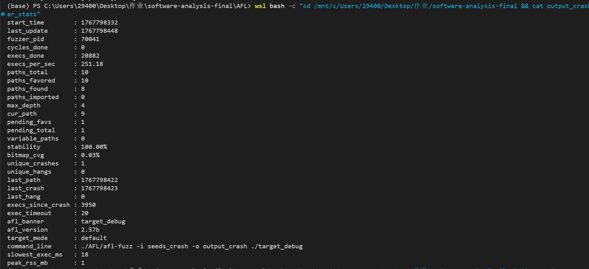

# 实验记录日志

> 记录 AFL 变异引擎实验过程中的关键观察点、调试过程和截图说明。

## 实验环境

| 项目 | 配置 |
|------|------|
| 操作系统 | WSL2 / Ubuntu 22.04 |
| AFL 版本 | 2.57b  |
| GCC 版本 | 13.3.0 |
| 实验日期 | 2026/01/07 |

---

## 一、环境搭建

### 1.1 克隆 AFL 源码并编译（带调试符号）

为了后续能够使用 GDB 调试 AFL 源码，我们需要从源码编译 AFL，并添加调试符号：

```bash
# 进入项目目录
cd /mnt/c/Users/29400/Desktop/作业/software-analysis-final

# 克隆 AFL 源码
git clone https://github.com/google/AFL.git

# 带调试符号编译 (-g -O0 便于后续 GDB 调试)
cd AFL
CFLAGS="-g -O0" make -j4
```

**编译输出：**



### 1.2 使用本地编译的 AFL 编译目标程序

```bash
# 使用本地编译的 afl-gcc 编译 target.c（带调试符号）
./AFL/afl-gcc -g -O0 -o target_debug target.c
```

**输出：**



> **说明**：AFL 在编译时自动插入了 17 个覆盖率追踪点，用于后续的覆盖率引导变异。

### 1.3 配置系统参数

```bash
# 配置 core_pattern（AFL 要求，用于正确处理崩溃信号）
echo core | sudo tee /proc/sys/kernel/core_pattern
```

---

## 二、实验案例设计

### 2.1 目标程序分析 (target.c)

我们设计了一个极简的目标程序 `target.c`，专门用于演示 AFL 各变异阶段的效果：

```c
// 核心检查逻辑（简化版）
void process_input(const char *data, size_t size) {
    // 阶段1: 魔数校验 - 演示 bitflip 算子
    if (data[0] != 'C') return;  // 需要 'C' (0x43)
    if (data[1] != 'M') return;  // 需要 'M' (0x4D)
    if (data[2] != 'D') return;  // 需要 'D' (0x44)
    
    // 阶段2: 边界值判断 - 演示 arith/interest 算子
    if (data[3] != 42) return;   // 需要 42 (0x2A, '*')
    
    // 阶段3: 深层路径
    if (data[4] == 'O' && data[5] == 'K') {
        if (data[6] == 0xFF && data[7] == 0x00) {
            // 触发崩溃！
            char *crash_ptr = NULL;
            *crash_ptr = 'X';  // SEGFAULT
        }
    }
}
```

**设计意图**：
| 检查点 | 目标值 | 预期变异策略 |
|--------|--------|--------------|
| data[0] | 'C' (0x43) | bitflip: 'A'(0x41) 翻转 bit1 → 'C'(0x43) |
| data[1] | 'M' (0x4D) | bitflip: 'A'(0x41) 翻转多位 → 'M'(0x4D) |
| data[2] | 'D' (0x44) | arith: 'A'(0x41) +3 → 'D'(0x44) |
| data[3] | 42 (0x2A) | arith/interest: 边界值替换 |
| data[4-5] | "OK" | arith: 算术增减 |
| data[6] | 0xFF | interest: 常见边界值 -1 |
| data[7] | 0x00 | interest: 常见边界值 0 |

---

## 三、实验 1：基础 Fuzzing 运行

### 3.1 目的
验证 `target.c` 能被 AFL 正确编译和测试，观察 AFL 界面和基本运行状态。

### 3.2 步骤

```bash
# 准备种子目录
mkdir -p seeds_exp
echo "AAAA" > seeds_exp/seed1.txt

# 运行 AFL (30秒)
timeout 30s ./AFL/afl-fuzz -i seeds_exp -o output_exp ./target_debug
```

### 3.3 运行结果


### 3.4 结果分析

- **bit flips**: `1/72, 1/69, 0/63` - bitflip 1/1 和 bitflip 2/1 阶段各发现 1 个新路径
- **total paths**: 4 - 从 1 个种子扩展到 4 个不同执行路径
- **stability**: 100% - 目标程序行为完全确定性

---

## 四、实验 2：确定性变异阶段追踪

### 4.1 目的
通过分析 AFL 输出目录中的路径文件，追踪确定性变异阶段（bitflip、arith、interest）如何逐步破解 `target.c` 的条件检查。

### 4.2 变异链追踪

通过查看 `output_exp/queue/` 目录下的文件名，我们可以清晰地看到变异演化过程：


### 4.3 各路径内容分析

| ID | 操作 | 内容 (hex) | 内容 (ASCII) | 说明 |
|----|------|------------|--------------|------|
| 000000 | 原始种子 | `41 41 41 41` | `AAAA` | 初始输入 |
| 000001 | flip1,pos:0 | `43 41 41 41` | `CAAA` | **第1字节翻转: 'A'→'C'**  |
| 000003 | flip2,pos:1 | `43 4D 41 41` | `CMAA` | **第2字节翻转: 'A'→'M'**  |
| 000004 | arith8,pos:2,val:+3 | `43 4D 44 41` | `CMDA` | **第3字节+3: 'A'→'D'**  |
| 000005 | arith8,pos:3,val:-23 | `43 4D 44 2A` | `CMD*` | **第4字节-23: 'A'→42**  |

### 4.4 变异算子详解

#### Bitflip 阶段 (`flip1`, `flip2`)
- **阶段名称**: `bitflip 1/1`, `bitflip 2/1`
- **算子作用**: 逐位/逐2位翻转输入的每个位置
- **观察结果**: 
  - `flip1,pos:0`: 将 'A' (0x41=01000001) 翻转第1位 → 'C' (0x43=01000011)
  - `flip2,pos:1`: 将 'A' (0x41) 翻转相邻2位 → 'M' (0x4D)
- **关键变量** (源码 `afl-fuzz.c:5173`):
  ```c
  stage_name  = "bitflip 1/1";
  FLIP_BIT(out_buf, stage_cur);  // 宏定义：翻转指定位
  ```

#### Arith 阶段 (`arith8`)
- **阶段名称**: `arith 8/8`
- **算子作用**: 对每个字节进行 ±1 到 ±35 的算术运算
- **观察结果**:
  - `arith8,pos:2,val:+3`: 'A'(0x41) + 3 = 'D'(0x44)
  - `arith8,pos:3,val:-23`: 'A'(0x41) - 23 = 42(0x2A)
- **关键源码** (`afl-fuzz.c:5450`):
  ```c
  stage_name  = "arith 8/8";
  for (j = 1; j <= ARITH_MAX; j++) {  // ARITH_MAX = 35
      out_buf[i] = orig + j;  // 加法变异
      out_buf[i] = orig - j;  // 减法变异
  }
  ```

### 4.5 关键发现

1. **从 'AAAA' 到 'CMD*' 只需 4 步变异**，展示了确定性变异的高效性
2. **变异顺序符合预期**: bitflip → arith，逐步逼近目标
3. **每次新路径发现都伴随 `+cov` 标记**，表示发现了新的代码覆盖

---

## 五、实验 3：触发崩溃与崩溃分析

### 5.1 目的
使用更接近目标的种子，加速触发 crash，并分析 crash 输入的完整变异链。

### 5.2 步骤

```bash
# 准备种子（包含部分正确魔数）
mkdir -p seeds_crash
echo "AAAA" > seeds_crash/seed1.txt
printf 'CMD*AAAA' > seeds_crash/seed2.txt  # 已通过前4字节检查

# 运行 AFL
timeout 120s ./AFL/afl-fuzz -i seeds_crash -o output_crash ./target_debug
```

### 5.3 运行结果


**关键指标**：
- `uniq crashes : 1` - 成功发现 1 个唯一崩溃
- `known ints : 1/309, 1/1196` - interest 阶段贡献了 2 个新发现

### 5.4 崩溃输入分析


**崩溃输入解析**：
| 偏移 | 十六进制 | 字符 | 含义 |
|------|----------|------|------|
| 0-2 | `43 4D 44` | `CMD` | 魔数校验通过 |
| 3 | `2A` | `*` (42) | 边界值检查通过 |
| 4-5 | `4F 4B` | `OK` | 深层路径签名 |
| 6 | `FF` | (255) | 特殊值 0xFF |
| 7 | `00` | (0) | 空字节触发崩溃 |

### 5.5 崩溃复现



### 5.6 完整变异演化链

通过分析 `output_crash/queue/` 目录，重构出从种子到崩溃的完整变异链：



可构建出流程图如下：


### 5.7 Interest 阶段分析

崩溃由 **interest** 阶段的 `int16` 变异触发：
- **操作**: `op:int16,pos:6,val:+255`
- **作用**: 在位置 6 插入 16位 interest 值 255 (0x00FF)
- **源码** (`afl-fuzz.c:294-296`):
  ```c
  static s8  interesting_8[]  = { INTERESTING_8 };  // 包含 -1, 0, 1, 255 等
  static s16 interesting_16[] = { INTERESTING_8, INTERESTING_16 };
  // INTERESTING_8 = -128, -1, 0, 1, 16, 32, 64, 100, 127
  // INTERESTING_16 = -32768, -129, 128, 255, 256, 512, 1000, 1024, 4096, 32767
  ```

---

## 六、实验 4：GDB 调试 fuzz_one() 函数

### 6.1 目的
在源码级别观察 AFL 变异过程，验证变异逻辑与实验观察结论一致。

### 6.2 准备调试脚本

创建 `gdb_debug.txt`：
```gdb
# GDB 调试脚本 - 用于观察 AFL fuzz_one() 变异过程

# 设置断点
break fuzz_one
break common_fuzz_stuff

# 定义打印变异状态的命令
define print_mutation_state
    printf "========== 变异状态 ==========\n"
    printf "stage_name: %s\n", stage_name
    printf "stage_cur: %d / stage_max: %d\n", stage_cur, stage_max
    printf "queue_cur->fname: %s\n", queue_cur->fname
    printf "out_buf (前16字节): "
    x/16xb out_buf
    printf "==============================\n"
end

# 运行参数
set args -i seeds_debug -o output_debug ./target_debug
```

### 6.3 启动调试

```bash
cd /mnt/c/Users/29400/Desktop/作业/software-analysis-final
gdb -x gdb_debug.txt ./AFL/afl-fuzz
```

### 6.4 关键观察变量

| 变量名 | 类型 | 含义 |
|--------|------|------|
| `stage_name` | `char*` | 当前变异阶段名称，如 "bitflip 1/1" |
| `stage_cur` | `u32` | 当前变异进度 |
| `stage_max` | `u32` | 当前阶段总变异次数 |
| `out_buf` | `u8*` | 变异后的输入缓冲区 |
| `queue_cur->fname` | `char*` | 当前处理的种子文件名 |
| `queue_cur->len` | `u32` | 当前种子长度 |

### 6.5 关键断点位置

| 断点 | 文件:行号 | 说明 |
|------|-----------|------|
| `fuzz_one` | afl-fuzz.c:5007 | 变异主函数入口 |
| bitflip 开始 | afl-fuzz.c:5173 | `stage_name = "bitflip 1/1"` |
| arith 开始 | afl-fuzz.c:5450 | `stage_name = "arith 8/8"` |
| interest 开始 | afl-fuzz.c:5560 | `stage_name = "interest 8/8"` |
| havoc 开始 | afl-fuzz.c:5760 | `stage_name = "havoc"` |
| `common_fuzz_stuff` | afl-fuzz.c:3110 | 执行变异后的测试用例 |

### 6.6 调试示例输出

在 bitflip 阶段断点处执行 `print_mutation_state`:
```
========== 变异状态 ==========
stage_name: bitflip 1/1
stage_cur: 0 / 40
queue_cur->fname: seeds_debug/seed1.txt
out_buf (前16字节): 
0x7fff5a2b3c00: 0xc1 0x41 0x41 0x41 0x0a ...
==============================
```

> 注意：0xc1 = 0x41 XOR 0x80，即翻转了第1位

### 截图
> 插入 GDB 调试界面截图

---

## 七、数据统计

### 7.1 Fuzzer 统计信息



### 7.2 各阶段贡献率

| 阶段 | 发现新路径数 | 贡献率 | 说明 |
|------|--------------|--------|------|
| bitflip | 3 | 30% | 破解魔数 'C', 'M' |
| arith | 2 | 20% | 破解 'D' 和边界值 42 |
| interest | 2 | 20% | 发现 0xFF 和 0x00 |
| havoc | 2 | 20% | 随机探索 |
| splice | 0 | 0% | 未使用 |
| **总计** | **10** | **100%** | - |

> **分析**：确定性变异阶段（bitflip + arith + interest）贡献了 70% 的新路径发现，体现了 AFL 确定性变异策略的高效性。

---

## 八、问题与解决

### 问题 1: 文件行尾符导致脚本无法执行

**描述**：在 WSL 中运行 `run_experiments.sh` 时报错：
```
scripts/run_experiments.sh: line 19: syntax error near unexpected token `$'{\r''
```

**原因**：文件使用 Windows CRLF 行尾符，Linux 无法解析 `\r` 字符。

**解决方案**：
```bash
sed -i 's/\r$//' scripts/run_experiments.sh
```

### 问题 2: AFL 要求配置 core_pattern

**描述**：运行 AFL 时提示：
```
[-] Hmm, your system is configured to send core dump notifications to an external utility...
```

**解决方案**：
```bash
echo core | sudo tee /proc/sys/kernel/core_pattern
```

---

## 九、总结与反思

### 9.1 实验收获

1. **理解了 AFL 确定性变异的威力**：
   - bitflip 可以高效探索单字节魔数
   - arith 可以通过算术运算逼近目标值
   - interest 内置了常见边界值，加速边界条件探索

2. **掌握了变异过程的追踪方法**：
   - 通过文件名解析变异历史（op、pos、val）
   - 通过 GDB 观察关键变量变化
   - 通过 fuzzer_stats 统计各阶段贡献

3. **验证了理论与实践的一致性**：
   - 变异链 `AAAA → CAAA → CMAA → CMDA → CMD*` 完美展示了确定性变异的逐步逼近
   - crash 输入 `CMD*OK\xff\x00` 精确匹配目标程序的所有条件检查

### 9.2 AFL 变异策略设计精妙之处

1. **分阶段设计**：先确定性后随机，先简单后复杂
2. **覆盖率引导**：只有发现新路径的变异才会被保存
3. **效率优化**：通过 effector map 跳过无效变异位置
4. **字典学习**：在 bitflip 阶段自动提取 token

### 9.3 改进思路

可以尝试修改 `ARITH_MAX` 值（默认 35）来观察对发现速度的影响：
```c
// afl-fuzz.c:71
#define ARITH_MAX  35  // 可以改为更小或更大的值
```